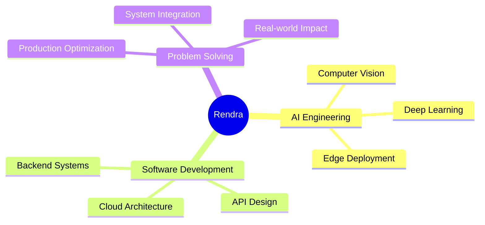

<div align="center">
  
</div>

<h1 align="center">
  
</h1>

<p align="center">
  <strong>AI Engineer • Computer Vision Specialist • Full-Stack Developer</strong><br/>
  <em>Transforming complex problems into intelligent solutions through AI and edge computing</em>
</p>

<div align="center">
  <a href="https://www.linkedin.com/in/rendra-baskoro-tuharea/">
    
  </a>
  <a href="mailto:rendrabtuharea@gmail.com">
    
  </a>
  
</div>

---

## 🎯 About Me

```yaml
role: AI & Computer Vision Engineer
location: Jakarta, Indonesia
focus: Real-world AI deployment from edge to cloud
mission: Building production-ready AI systems that create tangible impact
```

I specialize in developing and deploying **computer vision systems** and **AI solutions** that go beyond notebooks—delivering measurable value in production environments. From smart city infrastructure to medical diagnostics, I bridge the gap between cutting-edge research and real-world applications.

---

## 🛠️ Technical Arsenal

<details open>
<summary><b>🧠 AI & Computer Vision</b></summary>
<br/>

- **Object Detection & Tracking**: YOLO (v5-v11), DeepSort, ByteTrack
- **Face Recognition**: InsightFace, ArcFace, ONNX Runtime
- **Edge AI Deployment**: OpenVINO, TensorRT, ONNX optimization
- **Domain Expertise**: Smart Traffic, Medical Imaging, Agricultural AI
- **Frameworks**: PyTorch, TensorFlow, OpenCV, Scikit-learn

</details>

<details>
<summary><b>⚙️ Full-Stack & Infrastructure</b></summary>
<br/>

- **Backend**: Laravel, Node.js (Express), FastAPI, Flask
- **Databases**: MySQL, PostgreSQL, Redis
- **Cloud & DevOps**: Docker, AWS (EC2, S3, Lambda), GCP, CI/CD pipelines
- **APIs & Integration**: RESTful APIs, WebSocket, QRIS Payment (Xendit)
- **GIS & Mapping**: Leaflet, GeoJSON, Spatial Analysis

</details>

<details>
<summary><b>🔬 Data Science & ML</b></summary>
<br/>

- **NLP**: Text Classification, Sentiment Analysis, Fake News Detection
- **Deep Learning**: CNN, Transfer Learning, Model Optimization
- **Classical ML**: Decision Trees, SVM, Ensemble Methods
- **Tools**: Pandas, NumPy, Matplotlib, Seaborn, Jupyter

</details>

---

## 🚀 Featured Projects

<table>
<tr>
<td width="50%">

### 🏙️ Smart City & Transportation

**Realtime Vehicle Counter (Edge AI)**
- Optimized YOLO + OpenVINO for edge deployment
- Real-time CCTV stream processing for traffic analytics
- Deployed on Intel hardware with <50ms latency

**Multi-Object Tracking System**
- YOLO + DeepSort integration for accurate tracking
- Vehicle counting, trajectory analysis, and anomaly detection
- Production-ready for Smart Traffic Management

</td>
<td width="50%">

### 🏢 Enterprise & Government

**Aergas-APBN System** *(Private Project)*
- National gas distribution management platform
- Laravel + MySQL + GIS integration
- Actively used in Indonesia's APBN Jargas program
- Handles real-time logistics and infrastructure monitoring

**Face Recognition Authentication API**
- FastAPI + ONNX + PostgreSQL architecture
- Sub-200ms face matching for biometric authentication
- Scalable microservice design with Docker deployment

</td>
</tr>
<tr>
<td width="50%">

### 🌾 Agriculture & Medical AI

**Rice Disease Recognition System**
- Deep learning model for paddy disease detection
- Supports precision agriculture and crop management
- Mobile-friendly deployment for field usage

**Acne Classification & Analysis**
- CNN-based skin condition assessment
- Assists dermatology diagnostics
- Integration-ready API for health apps

</td>
<td width="50%">

### 🔍 Additional Innovations

- **YOLO-OCR Pipeline**: Industrial text detection and extraction
- **IoT Monitoring Dashboard**: Cloud-based real-time analytics
- **Fake News Detector**: NLP-powered misinformation classifier
- **Decision Support System**: SAW algorithm implementation
- **Semantic Recommendation Engine**: Knowledge graph-based parfume recommendation

</td>
</tr>
</table>

> 💼 **Available for demos** — Video demonstrations and technical documentation provided upon request

---

## 📊 GitHub Analytics

<div align="center">
  
  
</div>

<div align="center">
  
</div>

---

## 🎯 Professional Focus Areas

<div align="center">

| Domain | Technologies | Impact |
|:------:|:------------:|:------:|
| 🚗 **Smart Transportation** | YOLO, DeepSort, OpenVINO | Intelligent traffic systems, vehicle analytics |
| 🛰️ **Geospatial AI** | GIS, Spatial Analysis, Cloud | Infrastructure optimization, logistics |
| 🏥 **Medical Vision** | CNN, Transfer Learning | Diagnostic assistance, health monitoring |
| ⚡ **Edge AI Deployment** | ONNX, TensorRT, OpenVINO | Low-latency, production-grade inference |
| 🌐 **Enterprise Systems** | Laravel, FastAPI, Cloud | Scalable, mission-critical applications |

</div>

---

## 🏆 Core Competencies

<div align="center">



</div>

---

## 💡 Professional Philosophy

> **"Building AI that solves real problems — not just runs in notebooks."**

I believe in:
- ✅ **Production-first mindset**: Code that works in the real world
- ✅ **Performance optimization**: Speed and accuracy at scale
- ✅ **End-to-end delivery**: From research to deployment
- ✅ **Measurable impact**: Solutions that create tangible value

---

## 📬 Let's Connect

<div align="center">

### Open to opportunities in:
**AI Engineering • Computer Vision Research • Smart City Projects • Enterprise AI Solutions**

<br/>

📍 **Location**: Jakarta, Indonesia  
📧 **Email**: [rendrabtuharea@gmail.com](mailto:rendrabtuharea@gmail.com)  
💼 **LinkedIn**: [rendra-baskoro-tuharea](https://www.linkedin.com/in/rendra-baskoro-tuharea/)  

<br/>


</div>

---

<div align="center">
  <sub>⭐ Consider starring repositories you find useful | 🤝 Open to collaboration and consultation</sub>
</div>
